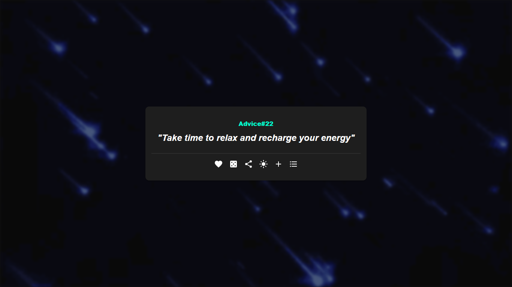

# Random Advice 🎯

Random Advice là một ứng dụng web được xây dựng bằng React, cho phép người dùng khám phá và lưu trữ những lời khuyên hữu ích. Dự án này sử dụng localStorage để lưu trữ dữ liệu, đảm bảo trải nghiệm người dùng liền mạch.

🔗 [Link website](https://react-advice.wuaze.com)



## ✨ Tính năng

- 🎲 Tạo lời khuyên ngẫu nhiên
- ⭐ Lưu lời khuyên yêu thích
- 🔍 Tìm kiếm lời khuyên
- 🌓 Chế độ sáng/tối
- 📱 Giao diện responsive
- 💾 Lưu trữ dữ liệu cục bộ

## 🚀 Công nghệ sử dụng

- React 18
- React Hooks
- LocalStorage
- MUI

## 📦 Cài đặt

1. Clone repository:
```bash
git clone https://github.com/your-username/random-advice.git
```

2. Di chuyển vào thư mục dự án:
```bash
cd random-advice
```

3. Cài đặt các dependencies:
```bash
npm install
```

4. Chạy ứng dụng ở môi trường development:
```bash
npm start
```

5. Build ứng dụng cho production:
```bash
npm run build
```
